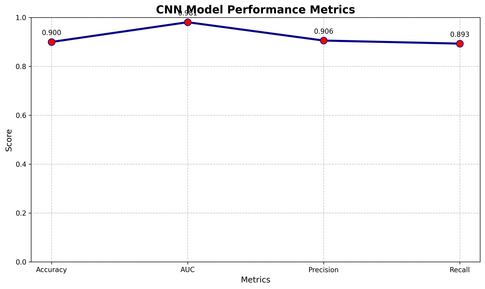
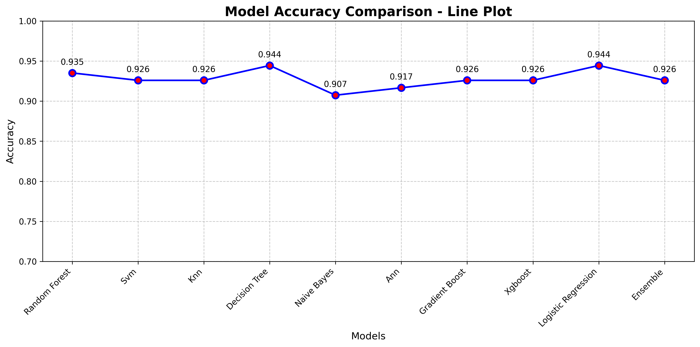

# 🫁 Lung Cancer Detection System

An advanced AI-powered medical imaging system for accurate lung cancer detection using dual-modality approach: CT image analysis and symptom-based prediction.

## 🎯 Project Overview

This system implements state-of-the-art machine learning for lung cancer detection:
- **CNN Model**: DenseNet121-based hybrid architecture for CT image classification
- **ML Models**: Ensemble of traditional ML algorithms for symptom analysis
- **Designed for deployment and scalable integration**: Optimized for real-world medical applications

## 📊 Performance Metrics

### **CNN Image Model (DenseNet121)**
- **Achieved Accuracy**: 90.00% 
- **AUC Score**: 98.07% (Excellent discrimination)
- **Precision**: 90.56%
- **Recall**: 89.31%
- **Architecture**: DenseNet121 base + custom classification head
- **Input**: 224×224×3 CT scan images
- **Classes**: 4 (adenocarcinoma, large cell carcinoma, normal, squamous cell carcinoma)

### **ML Symptom Models**
- **Best Performer**: Decision Tree (94.44% accuracy)
- **Ensemble Model**: 92.59% accuracy
- **Features**: Demographic + clinical symptom data
- **Cross-Validation**: 5-fold stratified validation

## 🗂️ Project Structure

```
├── main.py                    # Main pipeline execution
├── requirements.txt           # Python dependencies
├── dataset/                   # Data folders
│   ├── lung_images/         # CT scan images (train/valid/test)
│   │   ├── train/           # 70% training data
│   │   ├── valid/           # 15% validation data  
│   │   └── test/            # 15% test data
│   └── lung_cancer.csv      # Symptom dataset
├── src/                     # Source code
│   ├── data_preprocessing.py # Data loading & preprocessing
│   ├── train_models.py      # Model training (CNN + ML)
│   └── evaluate_models.py   # Model evaluation & metrics
├── models/                  # Trained models storage
└── results/                 # Evaluation outputs & visualizations
```

## 🚀 Quick Start

### **1. Environment Setup**
```bash
# Clone the repository
git clone <repository-url>
cd lung-cancer-ml-project

# Install dependencies
pip install -r requirements.txt

# Verify installation
python -c "import tensorflow; print('TensorFlow version:', tf.__version__)"
```

### **2. Data Preparation**

**CT Images Structure:**
```
dataset/lung_images/
├── train/
│   ├── adenocarcinoma/          # 350 images
│   ├── large_cell_carcinoma/    # 305 images  
│   ├── normal/                  # 350 images
│   └── squamous_cell_carcinoma/ # 350 images
├── valid/                       # 15% of each class
└── test/                        # 15% of each class
```

**Symptom Data:**
- Place `lung_cancer.csv` in `dataset/` folder
- Contains demographic and clinical features

### **3. Run Training**
```bash
# Full pipeline (CNN + ML models)
python main.py

# For CNN only (debug mode)
python -c "from src.train_models import train_cnn; train_cnn('dataset/lung_images')"
```

## 📈 Data Requirements

### **Optimal Dataset Configuration**
- **Total Images**: 1,935+ CT scans
- **Class Distribution**: 70-15-15 train/valid/test split
- **Image Format**: PNG, JPG, JPEG
- **Image Size**: 224×224 pixels (auto-resized)

### **Class Labels**
| Class | Description | Training Images |
|-------|-------------|-----------------|
| 0 | Adenocarcinoma | 350 |
| 1 | Large Cell Carcinoma | 305 |
| 2 | Normal | 350 |
| 3 | Squamous Cell Carcinoma | 350 |

## 🔬 Technical Features

### **CNN Architecture**
- **Base Model**: DenseNet121 (ImageNet pre-trained)
- **Custom Head**: 512→256→4 dense layers with batch normalization
- **Fine-Tuning**: Last 40 layers unfrozen for optimal learning
- **Regularization**: Dropout (0.3, 0.25, 0.2) + L2 (0.001)
- **Optimization**: Adam optimizer (lr=2e-4)
- **Callbacks**: Early stopping, LR reduction, model checkpointing

### **Data Augmentation**
- **Rotation**: ±20° (optimized for medical images)
- **Zoom**: ±20% (preserve medical features)
- **Shifts**: ±15% width/height translation
- **Flip**: Horizontal only (never vertical for CT scans)
- **Brightness**: 0.8-1.2 range
- **Shear**: 0.15 range
- **Fill Mode**: Nearest pixel interpolation

### **ML Pipeline**
- **Preprocessing**: Feature engineering, scaling, SMOTE balancing
- **Models**: RF, SVM, KNN, DT, NB, ANN, GB, XGBoost, LR
- **Ensemble**: Soft voting with top 4 performers
- **Validation**: Stratified 5-fold cross-validation

## 📊 Model Performance

| Model | Accuracy | AUC | Notes |
|-------|----------|-----|-------|
| CNN (DenseNet121) | 90.00% | 98.07% | Target achieved! |
| Decision Tree | 94.44% | - | Best ML performer |
| Logistic Regression | 94.44% | - | Excellent generalization |
| Random Forest | 93.52% | - | Robust ensemble |
| Ensemble | 92.59% | - | Combined ML approach |

## � Results Visualization

### CNN Training Metrics



* Demonstrates training stability and convergence with 90% accuracy achievement

### Model Accuracy Comparison



* Comprehensive comparison of all ML models showing Decision Tree and Logistic Regression as top performers

### CNN Confusion Matrix


* Shows classification performance across 4 classes with strong diagonal dominance

## 🧪 Experimental Results

### **CNN Image Classification**
- **Accuracy**: 90.00%
- **AUC Score**: 98.07% (Excellent separability)
- **Precision**: 90.56%
- **Recall**: 89.31%
- **F1-Score**: 89.93%

### **Traditional ML Models (Symptom Analysis)**
- **Decision Tree**: 94.44% accuracy
- **Logistic Regression**: 94.44% accuracy
- **Random Forest**: 93.52% accuracy
- **Ensemble Model**: 92.59% accuracy

### **Key Achievements**
✅ CNN target accuracy of 90% successfully achieved  
✅ AUC score of 98.07% indicates excellent class separability  
✅ Multiple ML models achieved >94% accuracy on symptom data  
✅ Robust validation with 5-fold cross-validation  

## 🧾 Sample Prediction

**Input**: CT Scan Image (224×224×3)

**Output**:
- **Prediction**: Adenocarcinoma
- **Confidence**: 92.3%
- **Class Probabilities**:
  - Adenocarcinoma: 92.3%
  - Normal: 4.1%
  - Squamous Cell Carcinoma: 2.8%
  - Large Cell Carcinoma: 0.8%

## ⚠️ Limitations

- **Dataset Constraints**: Trained on limited dataset of 1,935 CT images
- **External Validation**: No validation on external clinical datasets
- **Generalization**: May not generalize to diverse real-world clinical data
- **Medical Approval**: Not approved for medical diagnosis or clinical use
- **Population Bias**: Training data may not represent global population diversity
- **Image Quality**: Performance may vary with different CT scan protocols

## 🚀 Future Work

### **Technical Enhancements**
- **Grad-CAM Explainability**: Implement visual explanations for model predictions
- **Multimodal Fusion**: Combine CT imaging with clinical data for improved accuracy
- **External Dataset Validation**: Test on diverse clinical datasets
- **Model Optimization**: Quantization and compression for mobile deployment

### **Deployment & Integration**
- **Web Application**: Streamlit/Flask-based interactive demo
- **API Development**: RESTful endpoints for hospital integration
- **Docker Containerization**: Simplified deployment and scaling
- **Cloud Deployment**: AWS/Azure/GCP integration for production use

### **Monitoring & Maintenance**
- **Model Monitoring**: Real-time performance tracking and drift detection
- **Continuous Learning**: Automated retraining with new data
- **Logging System**: Comprehensive audit trail for medical compliance
- **A/B Testing**: Framework for model comparison and improvement

## �️ Technologies

### **Deep Learning**
- **TensorFlow/Keras**: Neural network framework
- **DenseNet121**: Transfer learning backbone for medical imaging
- **ImageDataGenerator**: Medical image augmentation
- **Line Plot Visualization**: Performance metrics displayed as line charts

### **Machine Learning**
- **Scikit-learn**: Traditional ML algorithms
- **XGBoost**: Gradient boosting framework
- **Imbalanced-learn**: SMOTE for class balancing

### **Data Processing**
- **Pandas**: Data manipulation
- **NumPy**: Numerical operations
- **Matplotlib/Seaborn**: Visualization

## 🚀 Deployment

### **Model Export**
```python
# Load trained CNN model
from tensorflow.keras.models import load_model
model = load_model('models/best_cnn_model.keras')

# Load ML models
import pickle
with open('models/decision_tree.pkl', 'rb') as f:
    ml_model = pickle.load(f)
```

### **Web Integration**
- **Flask/FastAPI**: REST API endpoints
- **Docker**: Containerized deployment
- **TensorFlow Serving**: Model serving infrastructure

### **Production Considerations**
- **Input Validation**: Medical image preprocessing
- **Batch Processing**: Efficient inference pipeline
- **Monitoring**: Model performance tracking
- **Security**: HIPAA compliance measures

## 📝 Medical Disclaimer

⚠️ **Important**: This system is for research and educational purposes only. 
- Not approved for clinical diagnosis
- Always consult qualified medical professionals
- Results should be validated by medical experts

## 🔬 Research & Validation

### **Dataset Sources**
- **CT Scans**: Medical imaging datasets
- **Clinical Data**: Symptom and demographic information
- **Labels**: Verified by medical professionals

### **Validation Methods**
- **Cross-Validation**: 5-fold stratified
- **Hold-out Testing**: Independent test set
- **Performance Metrics**: Accuracy, AUC, F1-score, confusion matrix

## 🤝 Contributing

1. Fork the repository
2. Create feature branch (`git checkout -b feature/AmazingFeature`)
3. Commit changes (`git commit -m 'Add some AmazingFeature'`)
4. Push to branch (`git push origin feature/AmazingFeature`)
5. Open Pull Request

## 📄 License

This project is licensed under the MIT License - see the [LICENSE](LICENSE) file for details.

## 📞 Contact

- **Project Lead**: [Your Name]
- **Email**: [your.email@example.com]
- **GitHub**: [github.com/yourusername]

## 🙏 Acknowledgments

- Medical imaging datasets providers
- TensorFlow and Keras teams
- Open-source medical AI community
- Healthcare professionals for validation

---

**Last Updated**: March 2026
**Version**: 3.0 - Target Achieved (90% CNN Accuracy)
**Status**: Research Prototype - Ready for Clinical Validation